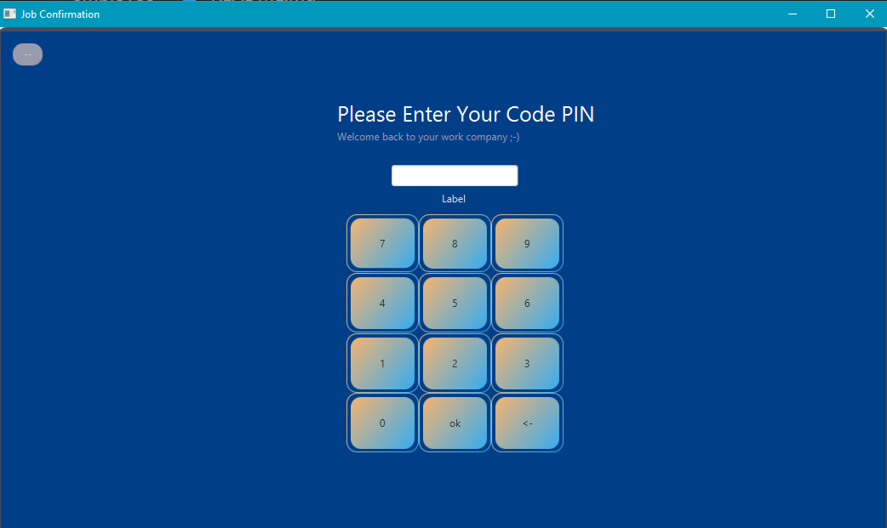

# Confirmation Database (JavaFX Application)

Welcome to the Confirmation Database of our JavaFX application! This application is designed to enable real-time communication with a JavaCard reader, allowing you to connect, confirm, and manage job affectations in the database effortlessly.



## Table of Contents

- [Features](#features)
- [Getting Started](#getting-started)
- [Usage](#usage)
- [Contributing](#contributing)
- [License](#license)

## Features

- **JavaCard Integration**: Seamlessly connect with a JavaCard reader for secure authentication and communication.

- **Real-time Affectations**: Confirm job affectations in real-time and manage employee balances.

- **Intuitive User Interface**: Enjoy a user-friendly JavaFX application interface for efficient job confirmation.

## Getting Started

To get started with the Confirmation Database application, follow these steps:

1. **Clone Repository**: Clone this GitHub repository to your local machine using the following command:
   ```shell
   git clone https://github.com/portmaler/javacard-employee-management.git

2. **Navigate to the Spring Boot App Directory:**

    ```bash 
    cd admin_ui

3. **Build and run the JavaFX app**