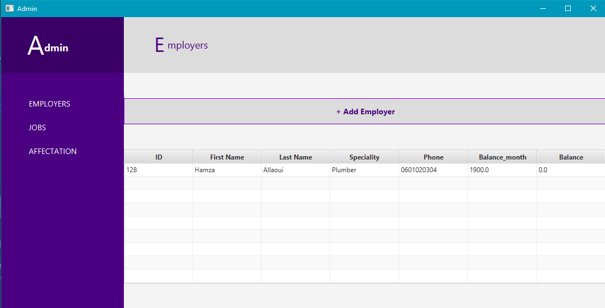

# Admin UI (JavaFX Application)

Welcome to the Admin UI of our JavaFX application! This user-friendly interface streamlines employee and job management, making it easier than ever to add, view, and manage employees, jobs, and affectations within your organization. 


## Table of Contents

- [Features](#features)
- [Getting Started](#getting-started)

## Features

- **Add Employees**: Effortlessly add new employees to the database. Enter employee details such as name, phone number, speciality, and balance.

- **Manage Jobs**: Create and manage job listings with ease. Specify job titles, descriptions, and prices.

- **Affectations**: Assign jobs to employees and keep track of job affectations.

- **Intuitive Interface**: Enjoy a user-friendly and intuitive JavaFX application interface.

## Getting Started

To get started with this Admin UI application, follow these steps:

1. **Clone Repository**: Clone this GitHub repository to your local machine using the following command:
   ```shell
   git clone https://github.com/portmaler/javacard-employee-management.git

2. **Navigate to the AdminUI JavaFX Directory:**

    ```bash 
    cd admin_ui

3. **Build and run the JavaFX app**
