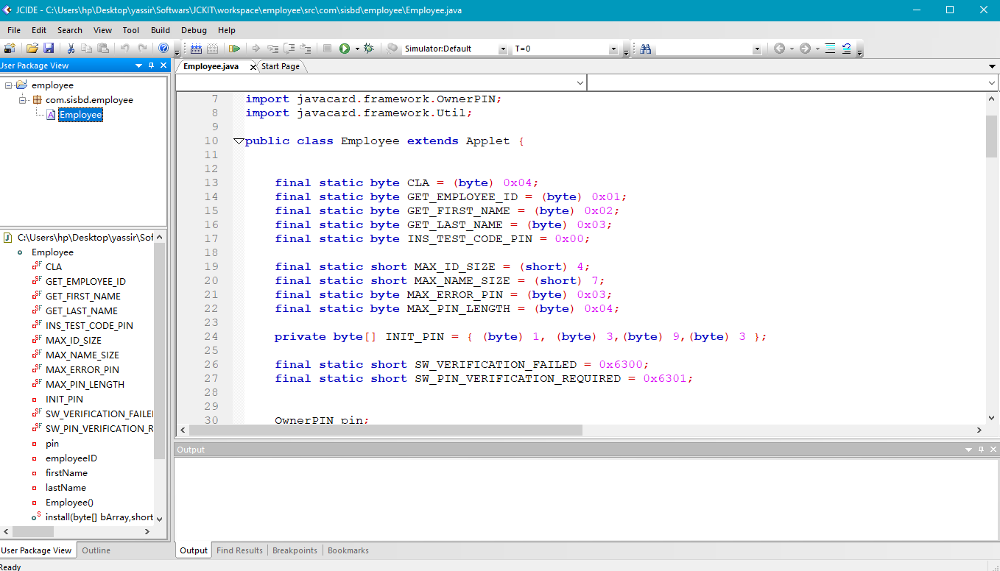

# Employee (JavaCard Applet)

Welcome to the "Employee" folder, which contains the JavaCard applet project and the `employee.cap` file. This applet is designed for secure PIN code authentication and retrieval of employee IDs, first names, and last names from a JavaCard. Below are instructions on how to upload the `employee.cap` file to a real JavaCard.

## Table of Contents

- [Applet Overview](#applet-overview)
- [Uploading to a Real JavaCard](#uploading-to-a-real-javacard)
- [Getting Started](#getting-started)
- [Contributing](#contributing)
- [License](#license)

## Applet Overview

The "Employee" applet is developed to provide secure authentication using a PIN code and retrieve essential employee information securely. The applet is compatible with JavaCards and JCOP cards.

## Uploading to a Real JavaCard

To upload the `employee.cap` file to a real JavaCard, you'll need the following:

1. **JavaCard Reader**: Ensure you have access to a JavaCard reader/writer and appropriate drivers for your system.

2. **JavaCard Development Kit**: Download and install a JavaCard development kit (JCIDE or similar).

3. **JavaCard Applet Installation Tool**: Use a tool like `gpshell` or the JavaCard Development Kit's installation tool to load the app

    onto your JavaCard. You can find these tools online or as part of your JavaCard development environment.

4. **Compile the Applet**: If you have the applet source code, compile it into a CAP file. Ensure you have the necessary dependencies and set up the development environment.

5. **Install the Applet**: Follow these general steps to install the applet:

   - Connect your JavaCard reader/writer to your computer.
   - Insert the JavaCard you want to use for the applet installation.
   - Use the JavaCard Applet Installation Tool to load the `employee.cap` file onto the card.
   - During installation, you might be prompted for the applet's AID (Application Identifier). Provide the AID if required.

6. **Verify Installation**: After the installation process is complete, you can verify that the applet is successfully installed on the JavaCard. You can use the same tool or commands to list the installed applets on the card.

7. **Test the Applet**: Develop or use a Java program to interact with the installed applet on the JavaCard. Send APDU commands to authenticate and retrieve employee information.

Please note that the exact steps and tools may vary depending on your specific JavaCard reader and development environment. Refer to the documentation provided with your tools for detailed instructions.
